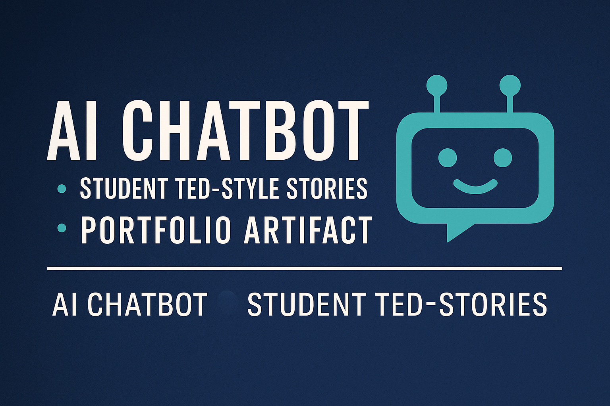

# My-Third-Artifact-Chatbox
<p align="center">
  
</p>

<h1 align="center">AI Chatbox – Portfolio Artifact</h1>
<h3 align="center">A Collaborative Chatbot Built from Real Student Stories</h3>

<p align="center">
  <a href="https://durowoju.github.io/My-Second-Artifact-Chatbox/">🌐 Live Portfolio Page</a> •
  <a href="https://github.com/Durowoju/My-Second-Artifact-Chatbox">💻 View Source on GitHub</a>
</p>

---

## 🔍 Project Overview

This artifact showcases an AI-style **chatbot powered by structured narrative data**.  
My classmates and I each wrote TED-style personal presentations. I transformed this shared document into a **clean JSON dataset** and built a chatbot that:

- Answers questions about each speaker  
- Summarizes their main message  
- Retrieves speakers by themes (growth, courage, AI, faith, etc.)  
- Provides short motivational responses based on their stories  

The goal was to move from **unstructured text → structured data → interactive AI behavior**, in a way that is transparent, explainable, and portfolio-ready.

---

## 🎯 Problem & Motivation

Many real-world AI systems rely on **text from humans** that is messy, inconsistent, or scattered across documents.  
This project explores:

- How to **structure human narratives** into a consistent format  
- How to design a **simple, explainable chatbot** without heavy ML  
- How to present AI work clearly for a **professional portfolio**

---

## ⚙️ How the Chatbot Works

1. **Source Content**  
   - TED-style scripts from multiple students (stories, intros, themes).

2. **Data Structuring**  
   - Converted into `data/presentations.json` with fields like:
     - `name`, `title`, `theme`, `tags`, `summary`.

3. **Chatbot Logic (`src/chatbot.py`)**  
   - Console menu with options to:
     - List all speakers  
     - List themes/tags  
     - Get info about a specific speaker  
     - Find speakers by theme/tag  
     - Get a random motivational summary  

4. **Response Generation**  
   - Uses rule-based retrieval and formatted printing for readable, motivational output.

---

## 🧱 Technologies Used

- **Python 3.x**  
- **JSON** for dataset storage  
- **Rule-based retrieval and menus** (no external ML libraries)  
- GitHub & GitHub Pages for hosting and portfolio presentation  

---

## 👤 My Role & Contributions

- Designed the **dataset structure** for all speakers  
- Converted the shared document into `presentations.json`  
- Implemented the improved **menu-based chatbot** in Python  
- Wrote the **portfolio documentation** and reflection  
- Connected the project to **GitHub Pages** as a live artifact

---

## 🧰 Skills Demonstrated

- Data cleaning and text structuring  
- Basic conversational system design  
- Python scripting and console UI  
- Documentation and portfolio storytelling  
- Collaboration on a multi-person content project  

---

## 🪞 Reflection

This project helped me see how much work happens **before** any AI model is applied: cleaning, structuring, and understanding the data. By building a simple, rule-based chatbot, I practiced thinking like an AI designer—how content, structure, and interface all influence the user’s experience. It also strengthened my ability to present technical work in a way that is accessible to instructors, classmates, and future employers.

---

## ▶️ How to Run Locally

```bash
git clone https://github.com/Durowoju/My-Second-Artifact-Chatbox.git
cd My-Second-Artifact-Chatbox
python src/chatbot.py
```
## 🧱 System Workflow

## 🧩 System Workflow

```mermaid
flowchart TD
    A[Student TED-style scripts (Word document)] --> B[Data Cleaning & Structuring]
    B --> C[presentations.json (Structured JSON dataset)]
    C --> D[Python Chatbot Logic (src/chatbot.py)]
    D --> E[Console Menu]
    E --> F{User selects option<br/>(speaker, theme, random)}
    F --> G[Retrieve matching record from JSON]
    G --> H[Formatted response<br/>(summary, details, motivation)]
```


You’ll see a menu where you can explore speakers, themes, and motivational summaries driven by real student stories.
